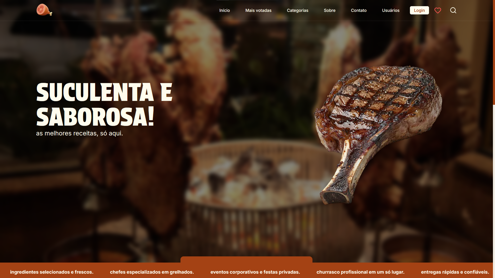

# Okorok

> Plataforma de receitas culinárias que permite aos usuários criar, compartilhar e descobrir receitas.
>
> Site: [Okorok](https://okorok.vercel.app/)

<!-- ## Ajustes e melhorias

O projeto ainda está em desenvolvimento e as próximas atualizações terão foco nas seguintes tarefas:

- [ ] Melhoria 1 -->
